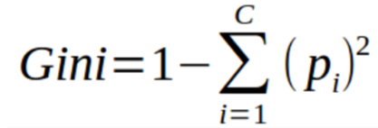
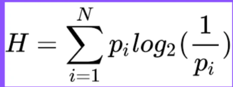

# Mastering the Basics: How Decision Trees Simplify Complex Choices

## Overview

A **Decision Tree** is a versatile and powerful tool used in data science and machine learning to make decisions, classify data, and predict outcomes. This model mimics human decision-making by breaking down complex choices into a series of simpler, hierarchical decisions. By mastering the basic concepts, math, and code involved in decision trees, you can better understand how this tool simplifies complex problems, ultimately enabling better decision-making.

This README provides a complete explanation of **Decision Trees**, covering their core concepts, mathematical foundations, and practical implementation in code.

---

## Table of Contents

- [Mastering the Basics: How Decision Trees Simplify Complex Choices](#mastering-the-basics-how-decision-trees-simplify-complex-choices)
  - [Overview](#overview)
  - [Table of Contents](#table-of-contents)
  - [What is a Decision Tree?](#what-is-a-decision-tree)
    - [Key Components:](#key-components)
  - [How Do Decision Trees Work?](#how-do-decision-trees-work)
  - [Mathematics Behind Decision Trees](#mathematics-behind-decision-trees)
    - [1. **Gini Impurity** (Used in Classification)](#1-gini-impurity-used-in-classification)
    - [2. **Entropy** (Used in Classification)](#2-entropy-used-in-classification)
    - [3. **Information Gain** (Used in Classification)](#3-information-gain-used-in-classification)
    - [4. **Mean Squared Error (MSE)** (Used in Regression)](#4-mean-squared-error-mse-used-in-regression)
  - [Advantages and Disadvantages](#advantages-and-disadvantages)
    - [Advantages:](#advantages)
    - [Disadvantages:](#disadvantages)

---

## What is a Decision Tree?

A **Decision Tree** is a flowchart-like structure that helps make decisions by answering a series of questions. It is commonly used in:

- Classification tasks (predicting categories or classes)
- Regression tasks (predicting continuous values)

Each node in the tree represents a decision or test, and the branches represent the outcomes of those tests. The leaf nodes hold the final decision or prediction.

### Key Components:
1. **Root Node**: The first decision point (starting point).
2. **Decision Nodes**: Nodes where the data is split based on specific conditions.
3. **Leaf Nodes**: The end nodes that represent the predicted class or outcome.

---

## How Do Decision Trees Work?

Decision Trees work by recursively splitting data into subsets based on certain conditions. The goal is to divide the dataset into increasingly homogeneous sets. For classification tasks, each leaf node will contain data points that belong to the same class.

The process of building a Decision Tree can be broken down into the following steps:

1. **Select the Best Feature**: Choose the feature that best splits the data at each node. The criteria for this selection are usually based on metrics like **Gini impurity**, **Entropy**, or **Mean Squared Error (MSE)**.
   
2. **Split the Data**: Divide the data based on the chosen feature. This process continues recursively until all data points belong to a single class or a stopping condition is met (such as maximum depth or minimum data points per leaf).

3. **Make Predictions**: Once the tree is built, you can make predictions by following the path from the root to a leaf node, based on the input features.

---

## Mathematics Behind Decision Trees

To build an effective Decision Tree, we need to assess how well a feature splits the data at each step. This is where mathematical metrics come into play.

### 1. **Gini Impurity** (Used in Classification)
Gini impurity measures the impurity of a dataset. For a dataset \(D\), the Gini impurity is calculated as:

Where:
- \(n\) is the number of classes
- \(p_i\) is the proportion of data points in class \(i\)

The lower the Gini value, the more "pure" the dataset is.

### 2. **Entropy** (Used in Classification)
Entropy is another measure of impurity. It quantifies the uncertainty in the dataset:

Where:
- \(p_i\) is the proportion of data points in class \(i\)

Entropy reaches its maximum when the data is perfectly mixed between classes and is minimized when all data points belong to the same class.

### 3. **Information Gain** (Used in Classification)
Information Gain is a metric derived from entropy that tells us how much information we gain by splitting a dataset at a particular feature. It is calculated as:

Where:
- \(D_v\) is the subset of data where feature \(A\) takes value \(v\)
- \(|D|\) and \(|D_v|\) are the sizes of the dataset and subset respectively

The feature that maximizes Information Gain is chosen for the split.

### 4. **Mean Squared Error (MSE)** (Used in Regression)
For regression tasks, the impurity measure is often **Mean Squared Error (MSE)**. MSE is calculated as:

Where:
- \(y_i\) is the actual value for data point \(i\)
- \(\hat{y}\) is the predicted value (usually the mean of \(y_i\))

A smaller MSE indicates a better split for regression tasks.

---

## Advantages and Disadvantages

### Advantages:
1. **Interpretability**: Decision Trees are easy to understand and interpret.
2. **No Feature Scaling**: They don’t require feature scaling (e.g., normalization or standardization).
3. **Handles Missing Values**: Decision Trees can handle missing data by splitting the available features.
4. **Non-linear Relationships**: They can model complex relationships between features.

### Disadvantages:
1. **Overfitting**: Decision Trees tend to overfit, especially when the tree is deep and complex.
2. **Instability**: Small changes in the data can lead to a different tree being generated.
3. **Bias**: Can be biased if some classes dominate the dataset or certain features are too strong.

---

**Conclusion**

Decision Trees are a powerful tool for both classification and regression tasks, offering simplicity and interpretability. Understanding the key concepts, mathematical metrics like Gini impurity and entropy, and how to implement a Decision Tree in code are crucial for mastering this method. While they are straightforward to use, it’s important to be mindful of their potential for overfitting and instability. By controlling tree depth and other hyperparameters, you can build robust models that help in solving complex decision-making problems.

With this knowledge in hand, you can apply Decision Trees to a wide range of real-world problems, from predicting customer churn to diagnosing diseases!