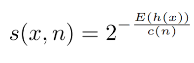

# ** Building Isolation Forest/Tree and Calculating Anomaly Scores Manually**

This README outlines the steps involved in **building an Isolation Forest** from scratch and **calculating anomaly scores** manually. It also covers the tools and stack used, along with the advantages of using the Isolation Forest algorithm for anomaly detection.

---

## **Table of Contents**
- [\*\* Building Isolation Forest/Tree and Calculating Anomaly Scores Manually\*\*](#-building-isolation-foresttree-and-calculating-anomaly-scores-manually)
  - [**Table of Contents**](#table-of-contents)
  - [**Introduction**](#introduction)
  - [**Stack and Requirements**](#stack-and-requirements)
  - [**Building Isolation Tree**](#building-isolation-tree)
    - [**Steps to Build an Isolation Tree**:](#steps-to-build-an-isolation-tree)
  - [**Calculating Anomaly Scores**](#calculating-anomaly-scores)
    - [**Anomaly Score Formula**:](#anomaly-score-formula)
  - [**Advantages of Isolation Forest**](#advantages-of-isolation-forest)
  - [**Usage Example**](#usage-example)
    - [**Step-by-Step Usage**](#step-by-step-usage)
  - [**Conclusion**](#conclusion)
    - [**References**](#references)

---

## **Introduction**

Isolation Forest (IF) is a machine learning algorithm specifically designed for **anomaly detection**. It works by isolating anomalies instead of profiling normal data points. The algorithm builds multiple **Isolation Trees** (iTrees), and points that require fewer splits to isolate are considered anomalies. In this project, we will manually build the Isolation Trees and compute the anomaly scores based on the number of splits required for isolation.

---

## **Stack and Requirements**

- **Programming Language**: Python 3
- **Libraries**:
  - `NumPy` for numerical operations (e.g., calculating means, standard deviations).
  - `math` for logarithmic and harmonic number calculations.
  - `scikit-learn` for the Isolation Forest algorithm (optional, for comparison).
  
**Installation**:
```bash
pip install numpy scikit-learn
```

---

## **Building Isolation Tree**

### **Steps to Build an Isolation Tree**:
1. **Randomly Select Feature**:  
   Select a feature from the dataset at random.

2. **Random Split**:  
   Randomly choose a value within the range of that feature's values to split the data.

3. **Partition the Data**:  
   Split the dataset into two groups:
   - One group where feature values are less than the split value.
   - Another group where feature values are greater than or equal to the split value.

4. **Repeat Recursively**:  
   For each partition, repeat the process until one of the stopping conditions is met:
   - The partition has only one point.
   - The tree reaches the maximum depth \( \log_2(n) \), where \( n \) is the number of data points.

5. **Path Length**:  
   The **path length** \( h(x) \) for each point is the number of splits required to isolate that point.

---

## **Calculating Anomaly Scores**

### **Anomaly Score Formula**:
Once the Isolation Trees are built, the anomaly score is calculated using the formula:



Where:
- \( E(h(x)) \) is the expected path length to isolate point \( x \).
- \( c(n) \) is a normalization constant based on the number of data points \( n \).
- \( H(n) \) is the harmonic number, approximated as \( H(n) \approx \ln(n) + 0.577 \).

The **lower the path length** (i.e., fewer splits needed to isolate the point), the **higher the anomaly score** (i.e., the point is more likely to be an anomaly).

---

## **Advantages of Isolation Forest**

1. **Efficient**:  
   The Isolation Forest algorithm has a time complexity of \( O(t \cdot n \log n) \), where \( t \) is the number of trees. This is more efficient than other anomaly detection methods like DBSCAN and k-means for large datasets.

2. **Scalable**:  
   Isolation Forest is highly scalable and works well with datasets that have thousands or even millions of data points. It can easily be parallelized for distributed computing.

3. **No Assumptions About Data Distribution**:  
   Unlike other algorithms like Gaussian Mixture Models, Isolation Forest does not assume any specific distribution of the data. It is useful for data with non-Gaussian distributions and datasets with mixed feature types.

4. **Effective for High-Dimensional Data**:  
   Isolation Forest can handle high-dimensional datasets without much performance loss, making it suitable for complex, real-world data.

5. **Interpretability**:  
   The Isolation Tree is simple to understand and provides interpretable insights, such as how many splits were required to isolate a point.

---

## **Usage Example**

### **Step-by-Step Usage**

1. **Install Dependencies**:
    ```bash
    pip install numpy scikit-learn
    ```

2. **Build an Isolation Tree**:
    Manually build an isolation tree for the dataset by selecting random features and splitting the data.

3. **Calculate Anomaly Scores**:
    Use the path length information from the isolation tree to compute the anomaly score for each data point.

4. **Example Code**:
    ```python
    import numpy as np
    from sklearn.ensemble import IsolationForest

    # Sample dataset
    X = np.array([10, 12, 14, 15, 13, 12, 11, 200]).reshape(-1, 1)

    # Build an Isolation Forest model
    iso_forest = IsolationForest(contamination=0.1, random_state=42)
    iso_forest.fit(X)

    # Compute anomaly scores
    anomaly_scores = iso_forest.decision_function(X)
    print("Anomaly Scores:", anomaly_scores)

    # Detect anomalies
    anomalies = X[iso_forest.predict(X) == -1]
    print("Detected Anomalies:", anomalies)
    ```

    In this example:
    - **Anomaly Scores**: The `decision_function` method gives the anomaly score for each point.
    - **Detected Anomalies**: The `predict` method returns `-1` for anomalies and `1` for normal points.

---

## **Conclusion**

Isolation Forest is an efficient and scalable anomaly detection algorithm that works by isolating rare data points (anomalies) from normal points. By manually implementing the building of Isolation Trees and calculating anomaly scores, you can gain a deeper understanding of the mechanics behind this powerful algorithm. It is particularly advantageous for high-dimensional datasets and situations where the distribution of the data is unknown or non-Gaussian.

---

### **References**
- "Isolation Forest" by Liu, Ting, and Zhou (2008)
- Scikit-learn documentation: [https://scikit-learn.org/stable/modules/generated/sklearn.ensemble.IsolationForest.html](https://scikit-learn.org/stable/modules/generated/sklearn.ensemble.IsolationForest.html)

