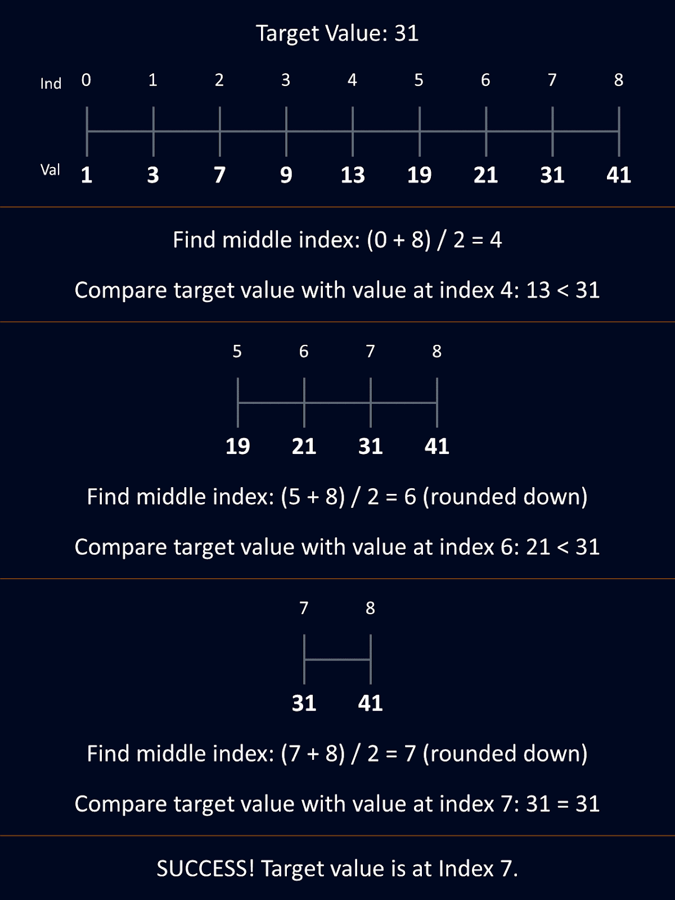

**Binary Search in Python: A Complete Guide for Efficient Searching**

This project provides a comprehensive, hands-on guide to **binary search** in Python, covering:

- Iterative and recursive implementations

- A conceptual overview of how binary search works

- Performance comparisons with linear search

- Usage of Python’s built-in bisect module

Whether you're learning algorithms or looking to implement efficient search routines in Python, this notebook is a great reference.

# What is Binary Search?

**Binary Search** is a classic algorithm used to find an element's index in a **sorted** list. Instead of checking elements one by one like linear search (O(n)), binary search repeatedly divides the search interval in half, achieving a much faster **O(log n)** time complexity.

# How It Works

1. Start with a sorted array.

2. Compare the target value to the middle element.

3. If equal, you're done.

4. If the target is smaller, repeat the search on the left half.

5. If larger, repeat on the right half.

6. Continue until the target is found or the range is empty.



#  Efficiency

- Linear Search: O(n)

- Binary Search: O(log n)

Binary search dramatically reduces the number of comparisons needed, especially for large datasets.

# Implementations
- Iterative Method

```bash
    def binary_search_iterative(arr, target):
    left, right = 0, len(arr) - 1
    while left <= right:
        mid = left + (right - left) // 2
        if arr[mid] == target:
            return mid
        elif arr[mid] < target:
            left = mid + 1
        else:
            right = mid - 1
    return -1

```

# Recursive Method

```bash
    def binary_search_recursive(arr, target, left, right):
    if left > right:
        return -1
    mid = left + (right - left) // 2
    if arr[mid] == target:
        return mid
    elif arr[mid] < target:
        return binary_search_recursive(arr, target, mid + 1, right)
    else:
        return binary_search_recursive(arr, target, left, mid - 1)

```

# Example Usage
```bash
    arr = [2, 5, 8, 12, 16, 23, 38, 56, 72, 91]
    target = 56

```

# Contributing

Feel free to fork this project and add more search methods, visualizations, or performance tests!

# License

This project is licensed under the MIT License.

# AUTHOR
- Simanga Mchunu


