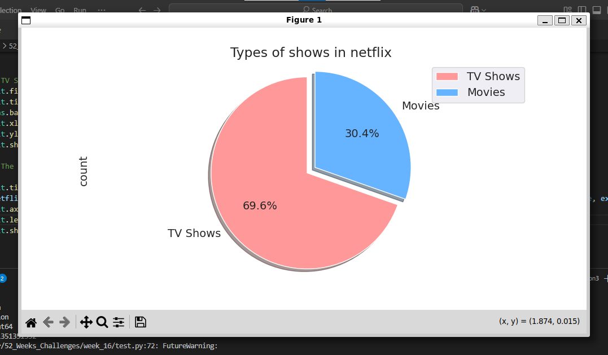

# 📊 Netflix Africa Streamlit App

This is a data analysis and visualization project built with **Streamlit**, focusing on Netflix's content distribution in **Africa**. It includes exploratory data analysis (EDA), visual storytelling, and a simple machine learning model to predict the next booming African country for Netflix content.

---

## 🚀 Features

- ✅ Load and clean Netflix titles dataset
- 📅 Analyze release trends over the years
- 🎬 Compare distribution of Movies vs. TV Shows
- 🌍 Focused insights into African countries (Top 5)
- 📈 Visualizations: bar plots, pie charts, count plots, heatmaps
- 🎭 Top genres, actors, and directors
- 🤖 Predictive ML model to forecast the next top African country

---

## 🧰 Tech Stack

- **Python 3.12**
- **Pandas**, **NumPy** for data handling
- **Matplotlib**, **Seaborn** for visualization
- **Scikit-learn** for machine learning
- **Streamlit** for app deployment

---

## 📦 Setup Instructions

1. **Clone the repo**

   ```bash
   git clone https://github.com/Simacoder/52_Weeks_Challenges.git
   cd 52_weeks_Challenges 
   then 
   cd week_16
   ```

# Set up a virtual environment (recommended)

```bash
    python3 -m venv venv
    source venv/bin/activate
```
# Install dependencies
```bash
pip install -r requirements.txt
Run the app
```
```bash
    streamlit run netflix_stream.py
```
📁 Dataset
This project uses the netflix_titles.csv dataset from Kaggle. Place the CSV file inside the data/ directory.

📍 Insights You'll Find
- When is the best time to release content?

- Which African countries are most active on Netflix?

- What genres dominate each content type?

- Which actors and directors are most featured?

Prediction of Netflix’s next booming African market

✨ Screenshots


🧠 Future Ideas
- Integrate with a live Netflix API 

- Enhance the prediction model using more features

- Add filters for dynamic visualization

- Deploy the app via Streamlit Cloud or Hugging Face Spaces

 # Author
- Simanga Mchunu

[GitHub](https://github.com/Simacoder)

📜 License
This project is open source under the MIT License.


