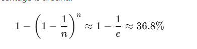

## 🌲 Random Forest Visualized & Explained with Code

This project offers a hands-on, visual guide to **Random Forests**, one of the most powerful and widely used ensemble learning methods in machine learning. It walks through how bootstrapping works, how Out-of-Bag (OOB) error is calculated, and how individual trees contribute to the final model — with clear, well-commented Python code and plots.

Inspired by [this excellent article on Towards Data Science](https://towardsdatascience.com/random-forest-explained-a-visual-guide-with-code-examples-9f736a6e1b3c/), this notebook-style project demonstrates core concepts of Random Forests in action.

---

## 📁 What's Inside

- ✅ Preprocessing categorical and numerical features
- 🔁 Manual creation of bootstrap samples & OOB evaluation
- 🌳 Visualization of individual decision trees from a Random Forest
- 📉 Plot of OOB error vs. number of trees
- 🧠 Intuition-building code comments and printed outputs

---

## 🧪 Dataset

A synthetic weather dataset is used to predict whether to "Play" or "Not Play" based on:
- Outlook (`sunny`, `rainy`, `overcast`)
- Temperature
- Humidity
- Wind (True/False)

---

## 📌 Key Concepts

### 🌳 What is Random Forest?
Random Forest is an ensemble of decision trees where each tree is trained on a bootstrapped sample of the data and makes predictions independently. The final prediction is based on majority voting (classification) or averaging (regression).

### 🔁 Bootstrapping & OOB
- **Bootstrapping**: Sampling with replacement to train each tree
- **Out-of-Bag (OOB)**: Data not included in a tree's training set; used for validation without needing a separate test set



### 📊 OOB Error Visualization
Plots how the OOB error rate changes with the number of trees, showing how the model stabilizes as more trees are added.

---

## 🖼️ Visual Examples

### 1. 🌲 Trees in the Forest

Visualizes trees #1, #2, and #100 from the Random Forest using `sklearn.tree.plot_tree`.

### 2. 📉 OOB Error Plot

Shows how error decreases as the number of trees increases — a helpful diagnostic tool for tuning `n_estimators`.

---

## 📦 Requirements

- Python 3.x
- numpy
- pandas
- matplotlib
- scikit-learn

Install with:

```bash
pip install numpy pandas matplotlib scikit-learn
```

▶️ How to Run
- Clone the repository or copy the code into a .py or .ipynb file.
- Run the script in any Python environment (Jupyter recommended).
- Check the terminal/console output for bootstrap and OOB sample stats.
- View plots showing tree structures and OOB error trends.

📚  # **References**

📘 [Random Forest, Explained (Towards Data Science)](https://towardsdatascience.com/random-forest-explained-a-visual-guide-with-code-examples-9f736a6e1b3c/)

📘 [scikit-learn RandomForestClassifier Docs](https://scikit-learn.org/1.5/modules/generated/sklearn.ensemble.RandomForestClassifier.html)

📜 **License**
This project is open source and shared for educational purposes under the MIT License.

# AUTHOR
- Simanga Mchunu