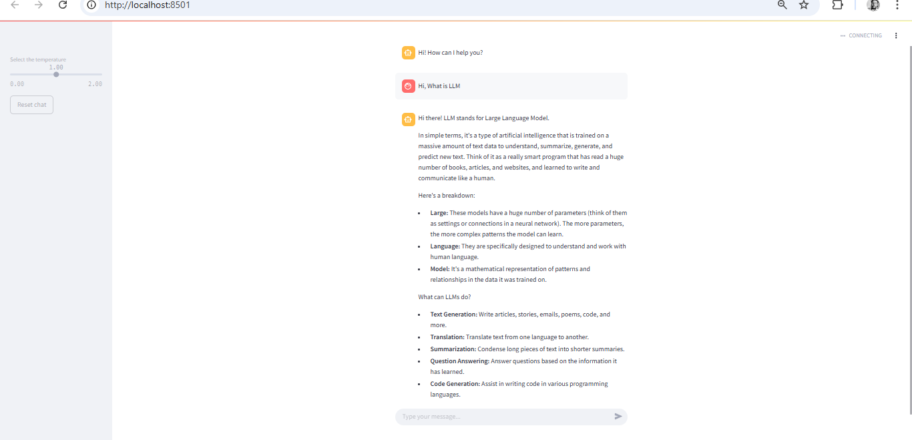

# 💬 Gemini AI Chatbot Tutor

A simple and interactive **AI-powered chatbot** built with [Streamlit](https://streamlit.io/) and [Gemini (Google Generative AI)](https://ai.google.dev/), designed to act as a **friendly programming tutor**.

This app responds to user questions about programming with clear, simple explanations and examples.

---

## ✨ Features

- 🧠 Uses **Gemini 2.0 Flash** model via Google Generative AI
- 🎯 Friendly and focused on **programming topics**
- 🔁 Maintains **chat history**
- 🧹 "Reset Chat" feature for fresh conversations
- 🎛️ Adjustable **temperature slider** to control response randomness
- 💅 Readable interface with **custom font size**

---

##  Screenshot

 

---

## 🚀 Getting Started

### 1. Clone the repository
```bash
git clone https://github.com/Simacoder/52_Weeks_Challenges.git
cd 52_Weeks_Challenges
cd week_18
```

2. Install dependencies
We recommend using a virtual environment:

```bash
    pip install -r requirements.txt
```
3. Set up your API key
Create a .env file or use your own secret manager to store:

 *env*

```bash
    API_KEY=your_google_generative_ai_key
    Or, modify the get_secret() function in functions.py to return your API key directly.
```
4. Run the app

```bash
    streamlit run app.py
```
# File Structure

```bash

├── app.py                # Main Streamlit app
├── functions.py          # Helper functions (e.g. get_secret, reset_chat)
├── requirements.txt      # Python dependencies
├── README.md             # You're here!
```
# How It Works
Uses the google.generativeai Python SDK to access Gemini models

Maintains chat history with st.session_state

Applies a system prompt to keep answers focused and educational

Uses custom CSS to increase font sizes for readability

# API Key Security
This project expects you to handle your API key securely. Do not hardcode your key in app.py. Use environment variables or secret managers.

# License
MIT License. See LICENSE file for details.

# Acknowledgements
- Google Generative AI
- Streamlit
- OpenAI ChatGPT

# AUTHOR
- Simanga Mchunu
