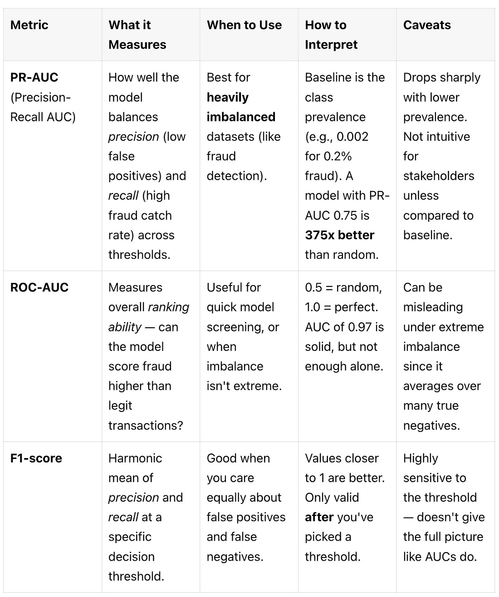

# **Imbalanced Data in Fraud Detection**

Credit-card fraud detection is the canonical “needle-in-a-haystack” problem: fewer than 1 in 1,000 transactions are fraudulent. If you train a vanilla classifier, it quickly learns that predicting legit every time maximises accuracy—and catches zero fraud.

## Why Imbalance Breaks Naïve Models

Imagine a dataset of 500,000 card swipes with 0.2% fraud (1,000 positives). A classifier that says “legit” for every record hits 99.8 % accuracy but protects no one. Traditional loss functions minimise overall error, so the model happily ignores the minority class.

Let’s have a look at some better metrics before we move on:

**Rule of thumb**: If positives ≪ negatives, prioritise PR-AUC for model selection and report confusion-matrix numbers at an operating threshold that meets business limits on false positives/negatives.

1. Downloads and loads the dataset

2. Performs exploratory data analysis (EDA)

3. Highlights correlations

4. Includes fraud ratio check, preprocessing, and baseline training

**Code Lab**: From Raw Fraud Data to First Model
Let’s go step-by-step through the credit card fraud dataset to see what imbalance really looks like—and how to start handling it.

**Load the Data**
You can download the data from here:

[Get data](https://www.kaggle.com/datasets/mlg-ulb/creditcardfraud?utm_source=substack&utm_medium=email)

# AUTHOR
- Simanga Mchunu
